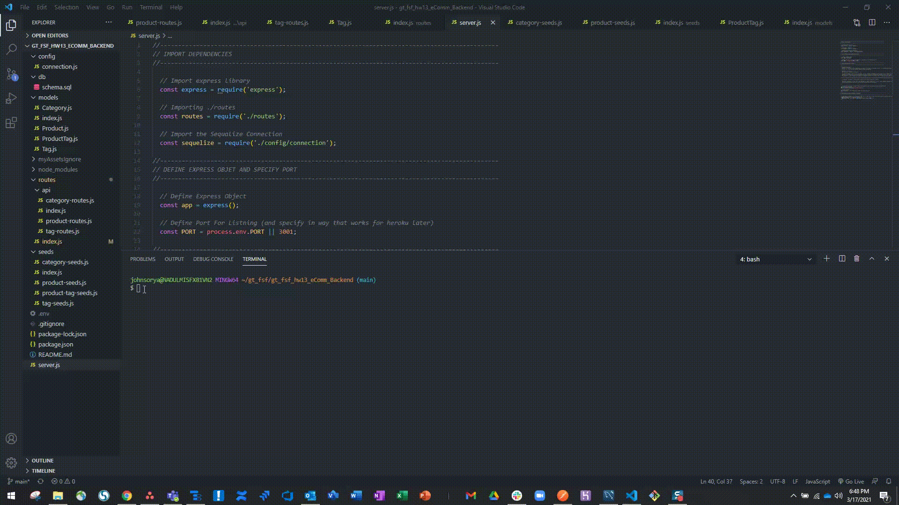

# gt_fsf_hw13_eComm_Backend

## Table of Contents
1. [Description](#Description)
3. [Usage](#Usage)
4. [Installation](#Installation)
5. [Licenses](#Licenses)
6. [Questions](#Questions)
7. [Credits](#Credits)

## Description
This assignment required that we utilize node js, mySQL, sequelize and other related npm libraries to construct a back-end for an eComm site. This assignment maintained focus on only building a back end, and utilizing postman to test server functionality and whether the api routes established were providing the expected JSON data and or allowing for adding, updating, or deleting of items to our existing database. I also utilized sequelize which simplified the server and database sync process, as well as the process for defining models and seeding my db. 

This assignment got me much more comfortable with using postman, and helped me better understand route mounting, module.exports and organization of code into more modular files and directories. In addition to that it further exposed me to database modeling and how to create and maintain relational data. Demonstration videos below show the required acceptance criteria being met. I did one demo for using sequalize.sync and the seeding functions I created, and then made one video per major route to demonstrate the outcome of all GET, POST, PUT, and DELETE calls. (The videos do not show the use of dotenv but this is implicit if you look at my connection.js within my config file).

**Demo Video Seeding and Syncing**  

**Demo Video for Category Routes**  

**Demo Video for Product Routes**  

**Demo Video for Tag Routes**  

## Usage
This application could be used as a backend supporting sites needing to get, modify, update or delete data about products, tags and categories. It was meant to simulate the type of work that might be needed to support the backend of an ecommerce site. 

## Installation
To install this application you just need to ensure that you have nodeJS and run the npm i command to get required dependencies. The package.json list which ones were utilized.

## Licenses
  
https://opensource.org/licenses/MIT

## Questions
Email me at ryanjohnson9685@gmail.com for more information.

## Credits
For this assignment I utilized class notes and recordings, as well as some MDM and W3 schools. I also reviewed the docs for sequelize, and reviewed some stack for questions I came across along the way.